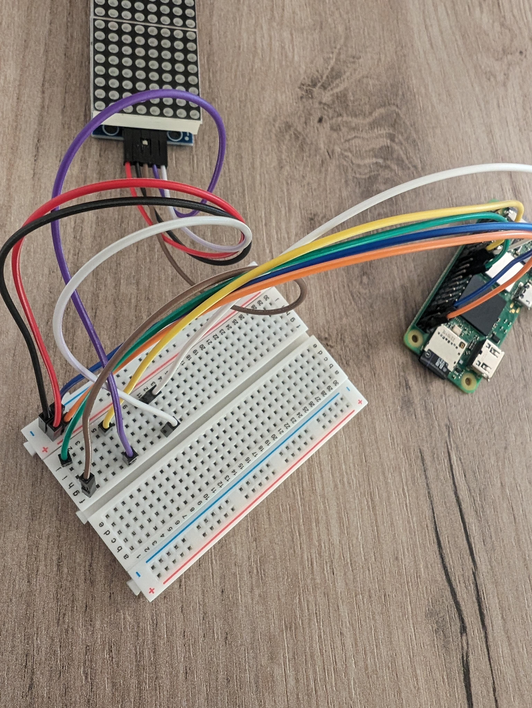

# Aplicație FastAPI pentru Matrice LED cu Raspberry Pi Zero 2 W

Aplicație FastAPI destinată să ruleze pe un Raspberry Pi Zero 2 W pentru a afișa mesaje pe o matrice de LED-uri. Aplicația primește mesaje prin intermediul unei interfețe web și le derulează pe matricea LED. În plus, interfața cuprinde două butoane prin care se poate schimba culoarea unui semafor. Semaforul își schimbă singur culoarea după 60 s dacă nu se intervine din butoane.

## Configurarea Sistemului de Operare și Mediului FastAPI

### Cerințe
- Raspberry Pi Zero 2 W
- Card SD (+ adaptor pentru anumite laptopuri)

### Pași de instalare
1. Instalează Raspberry Pi OS folosind Raspberry Pi Imager:
   - Descarcă și instalează Raspberry Pi Imager (https://www.raspberrypi.com/software/)
   - Alege SO-ul (de exemplu, Raspberry Pi OS Legacy Lite), scrie pe card și activează SSH prin opțiunile avansate.
   - Conectează Raspberry Pi la rețea și alimentare; așteaptă câteva minute pentru prima inițializare.

2. Conectează-te la Raspberry Pi folosind SSH:
   ```bash
   ssh [nume_utilizator]@raspberrypi.local
   ```
   - Numele de utilizator implicit este 'pi' iar parola 'raspberry'. 

3. Activează interfața SPI:
   - Rulează `sudo raspi-config`
   - Navighează la `Interfacing Options` > `SPI` și alege 'Yes' pentru a activa SPI.
   

4. Actualizează și instalează FastAPI:
   ```bash
   sudo apt update
   sudo apt install python3-pip
   pip3 install fastapi
   ```

5. Clonează sau extrage proiectul descărcat pe Raspberry Pi și navighează în directorul proiectului:
   ```bash
   cd [nume_aplicatie]
   ```
   Pentru transferul datelor de pe local pe Raspberry se poate folosi scp
   ```bash
   scp -r [nume_aplicatie] [nume_utilizator]@raspberrypi.local:/home/ligia/
   ```

6. Pentru a afla adresa la care rulează serverul, folosește comanda:
   ```bash
   hostname -I
   ```


7. Rulează aplicația FastAPI și accesează interfața web pentru a testa întreaga aplicație:
   ```bash
   python3 relu_serverelu/run.py
   ```
   Deschide un browser și navighează la http://[raspberry-pi-ip]:5000/ pentru a introduce și trimite mesaje alfanumerice către raspberry sau pentru a modifica culoarea semaforului.
   

## Configurarea Hardware

### Componente necesare
- Raspberry Pi (orice model care suportă SPI)
- Module MAX7219 pentru matricea de LED-uri (configurate în cascadă)

### Configurația Hardware
- Conectează modulele MAX7219 la Raspberry Pi prin interfața SPI. Asigură-te că legăturile pentru alimentare (5V și GND), DIN, CS și CLK sunt corect realizate conform configurației pinilor SPI de pe Raspberry Pi.



- Modul de conectare al pinilor dintre Raspberry și matricea led se regăsește în tabel:

| Raspberry Pi Zero 2 W             | Led Matrix Display |
|-----------------------------------|--------------------|
| 5V (PIN No – 2)                   | VCC                |
| GND (PIN No – 6)                  | GND                |
| GPIO 10 MOSI (PIN No – 19)        | DIN                |
| GPIO 8 Chip Enable (PIN No – 24)  | CS                 |
| GPIO 11 SCLK (PIN No – 23)        | CLK                |

### Configurare și orientare text
- Orientarea textului pe matricea de LED-uri este configurată prin parametrii `block_orientation` și `rotate` în fișierul `display.py`. 
- `block_orientation` este setat la `-90` pentru a orienta textul orizontal. Acest parametru este esențial pentru a ne asigura că textul derulează corect de la dreapta la stânga.

## Configurare Automată cu Cron Tab

Pentru a configura serverul FastAPI să pornească automat la fiecare pornire a Raspberry Pi:

1. Creează un script de pornire:
   ```bash
   sudo nano /home/pi/start_server.sh
   ```
   Adaugă următorul conținut:
   ```bash
   #!/bin/bash
   sleep 10
   cd /home/ligia/SM/relu_serverelu
   PYTHONPATH=/home/ligia/.local/lib/python3.9/site-packages /usr/bin/python3 run.py
   ```

2. Fă scriptul executabil:
   ```bash
   sudo chmod +x /home/pi/start_server.sh
   ```

3. Adaugă scriptul în crontab pentru a rula la boot:
   ```bash
   sudo crontab -e
   ```
   Adaugă următoarea linie:
   ```
   @reboot /bin/bash /home/ligia/SM/start_server.sh > /home/ligia/cronlog.txt 2>&1
   ```

## Configurare WiFi pe Rețele Diferite (Acasă și Laborator)

1. Editează fișierul `wpa_supplicant.conf`:
   ```bash
   sudo nano /etc/wpa_supplicant/wpa_supplicant.conf
   ```

2. Adaugă configurațiile rețelelor WiFi:
   ```
   network={
       ssid="numele_retelei_de_acasa"
       psk="parola_retelei_de_acasa"
   }

   network={
       ssid="numele_retelei_de_laborator"
       psk="parola_retelei_de_laborator"
   }
   ```

3. Repornește serviciul de rețea:
   ```bash
   sudo systemctl restart dhcpcd
   ```

## Explicație Cod

- `app/__init__.py`: Inițializează aplicația FastAPI și importă rutele.
- `app/device/display.py`: Gestionează configurarea și controlul matricei LED, inclusiv orientarea textului.
- `app/templates/index.html`: Șablonul HTML pentru formularul web utilizat pentru trimiterea mesajelor.
- `run.py`: Punctul de intrare al aplicației FastAPI care rulează serverul pe portul 5000.
- `app/main.py`: În acest fișier sunt configurate rutele aplicației în mod asincron.
